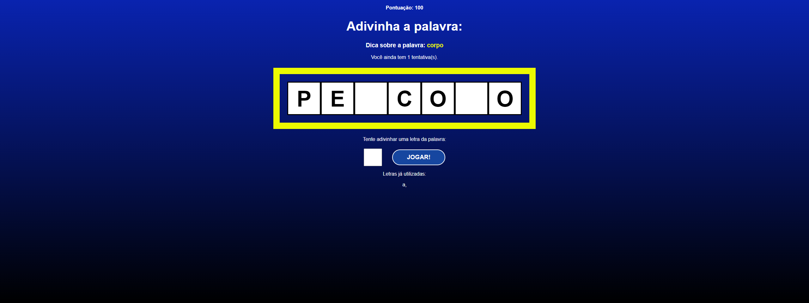

## Preview

<h1 align="center">
    
</h1>

<br>

## ⚙️ Tecnologias

Este projeto foi desenvolvido utilizando:

- [ReactJS](https://reactjs.org/)
- [CSS](https://developer.mozilla.org/pt-BR/docs/Web/CSS)
- [Vite](https://vitejs.dev/)

## 📌 Começando

Clone o projeto:

```bash
git clone https://github.com/gabrielcoutinh0/Secret-Word
cd "Secret Word"
```

Instale as dependências :

```bash
npm i
npm run dev
```

## 🖼️ Layout

- [Udemy](https://www.udemy.com/course/react-do-zero-a-maestria-c-hooks-router-api-projetos/)
